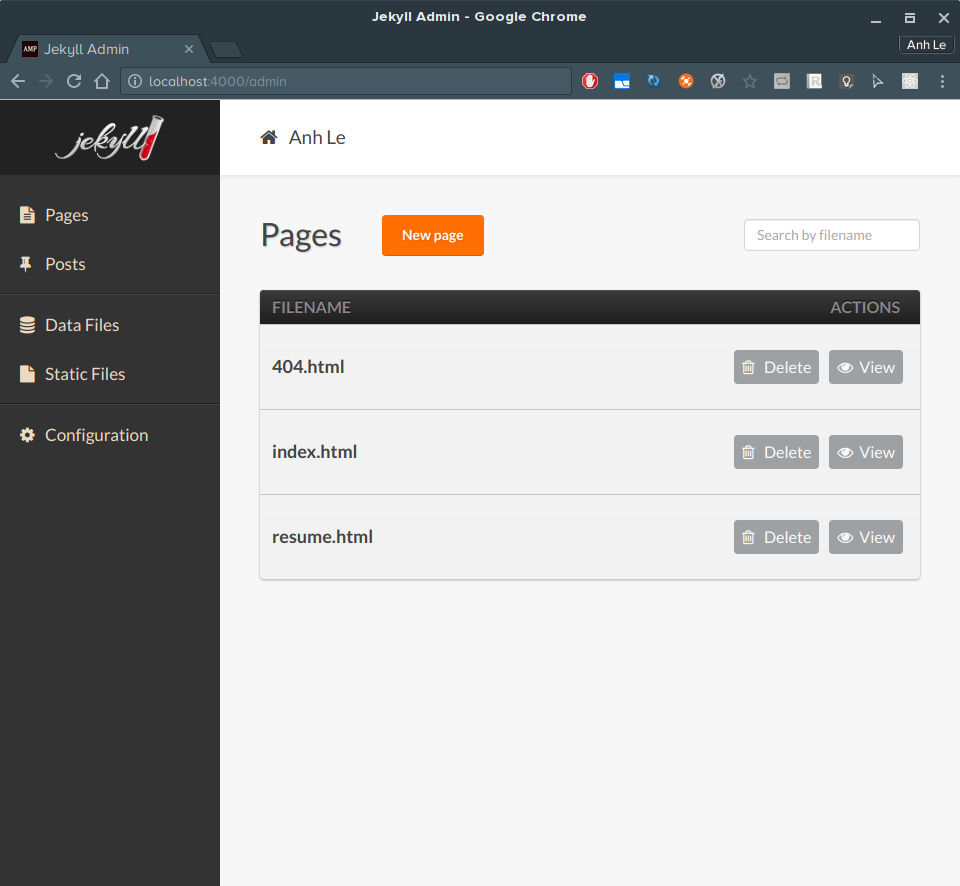
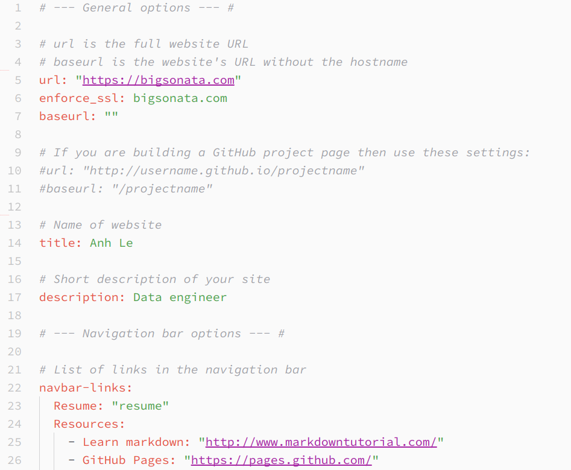
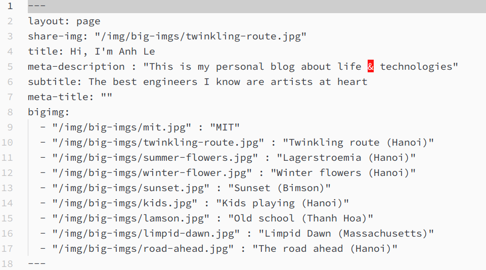
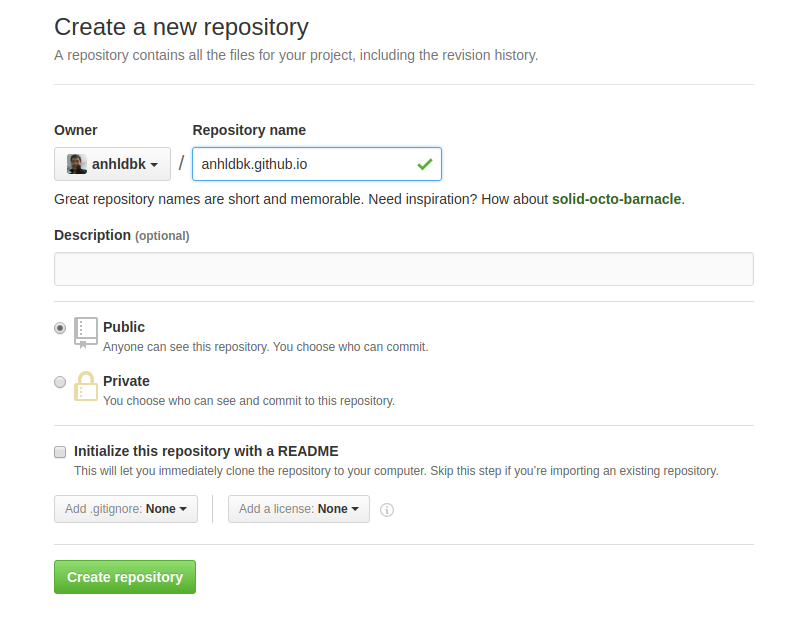

Jekyll Professional
==============

Another beautiful & professional Jekyll theme

## Overview

The theme for this website is customized from [beautiful-jekyll](https://github.com/daattali/beautiful-jekyll) and [online-cv](https://github.com/sharu725/online-cv/)

I've made 2 critical changes:

- Including [jekyll-admin](https://github.com/jekyll/jekyll-admin) by default. It will help us to manage our blogs locally.
- Unlike [online-cv](https://github.com/sharu725/online-cv/), information about CVs/Resumes is separated from the code. So it's easier for users to update.

I'm currently using this theme for my own blog at [https://bigsonata.com](https://bigsonata.com)

### Front page


### Resume page


### Admin page
[jekyll-admin](https://github.com/jekyll/jekyll-admin) provides you a simple interface for managing associated content


## Installation

To use this theme, you should follow these steps

### Install Prerequisites
Install ruby, the ruby development libraries, and the make command.
```sh
$ sudo apt-get install ruby ruby-dev make gcc nodejs
```

### Install Jekyll

Install the Jekyll gem system wide

```sh
$ sudo gem install jekyll --no-rdoc --no-ri
```

### Clone & install dependencies
Please do not clone branch `master`, as it contains some configuration values that are very specific to my site. Please use branch `theme` instead

```sh
$ git clone -b theme git@github.com:anhldbk/jekyll-professional.git
$ cd jekyll-professional
$ rm -rf .git # remove my repo information
$ bundle install
$ bundle exec jekyll serve --watch
```

If everything's ok, you open your blog locally at  [http://localhost:4000](http://localhost:4000).

The admin interface can be reached at [http://localhost:4000/admin](http://localhost:4000/admin).

## Configuration

Ok, this is the most boring part. The good news is you just have to configure it once. So let's configure & forget.

### Site information

The information is stored in file [_config.yml](_config.yml). Thanks [Dean Attali](https://github.com/daattali) for making thorough comments.

If you don't have any plan for using HTTPS on your website, please comment out `enforce-ssl` (at line #6)



### Resume

Please provide your formation's resume by editing file [_data/cv.yml](_data/cv.yml)


The configuration you see is encoded using `yaml` which provides a cleaner syntax than `json` does. New to `yaml`? Just give [Learn Yaml in Y minutes](https://learnxinyminutes.com/docs/yaml/) a shot.

### Page meta data

Page meta data is used by scrapers from social networks like Facebook. We should make the pages social friendly by overriding existing meta data.

**index.html**

Open it up and modify following fields

```yaml
share-img: "/img/big-imgs/twinkling-route.jpg"
title: Hi, I'm Anh Le
meta-description : "This is my personal blog about life & technologies"
subtitle: The best engineers I know are artists at heart
```

Here is what looks like when someone sharing my page (with above configuration) on facebook


**resume.html**

Again with below fields

```yaml
title: Resume
meta-description : Professional profile of Anh Le
```

## Theming

### Avatar

Place your avatar photo at [img/avatar.jpg](img/avatar.jpg)

### Favicon

You should create a favicon from your avatar. Ideally, the favicon should be circular, like mine:


You can then use [favicon-generator](http://www.favicon-generator.org/) to create & replace the default one at [img/favicon.ico](img/favicon.ico)

### Intro photos

Place your photos in directory [img/big-imgs](img/big-imgs) and make changes to configuration [index.html](index.html)



Additionally, you should compress your images to make your pages loaded faster. Online services like [http://jpeg-optimizer.com/](http://jpeg-optimizer.com/) will help you out.

### Deploy

This section is adapted & abridged from [Secure and fast GitHub Pages with CloudFlare](https://blog.cloudflare.com/secure-and-fast-github-pages-with-cloudflare/)

#### Setting up our repository

Create a GitHub repository which contains the files of the site we want to serve (such as our Jekyll source or our HTML). As my GitHub username is anhldbk, I can create a repository called `anhldbk.github.io`. Be sure that the repository name is all lowercase.



If you haven’t already, let’s initiate a repository where our site files are:

```sh
$ git init  
$ git add -A  
$ git commit -m “Initial commit.”  
```

We can now push files to our host by adding the origin as GitHub; make sure the URL of the origin is customised to be your own repository:

```sh
$ git remote add origin git@github.com:[your-username]/[your-username].github.io.git  
$ git push -u origin master  
```

You should now see your site when you visit your blog at http://[your-username].github.io.

### Setting up our DNS

I’ll assume you have registered a domain and added it to your CloudFlare account.
In order to for GitHub to accept traffic from this domain, we need to create a CNAME file in our repository which contains the hostname to accept traffic for.
The following rules apply:

- If the CNAME file contains example.com, then www.example.com will redirect to example.com.

- If the CNAME file contains www.example.com, then example.com will redirect to www.example.com.

In the Git repository we created in the previous section, let’s add a CNAME file to that repository and commit our changes:


### SSL

Websites use `HTTPS` to secure information transmitted and [potentially improve search engine rankings](https://webmasters.googleblog.com/2014/08/https-as-ranking-signal.html). This step is **optional** but I highly recommend you to take it. CloudFlare provides a great & free one-stop solution for us to use.

In the Crypto tab of [your CloudFlare site](https://www.cloudflare.com/a/overview) you should ensure your SSL mode is set to `Full` but not `Full (Strict)`:


We can now add a Page Rule to enforce HTTPS, as you add other Page Rules make sure this is the primary Page Rule:


We can also create a Page Rule to ensure that non-www is redirected to www securely when using HTTPS:


CloudFlare has a “Cache Everything” option in Page Rules. For static sites, it allows your HTML to be cached and served directly from CloudFlare's CDN.


When deploying your site you can use the `Purge Cache` option in the `Cache` tab on CloudFlare to remove the cached version of the static pages.

### Contributions

If you find anything wrong or would like to contribute in any way, feel free to create a pull request/open an issue/send me a message. Any comments are welcome!
